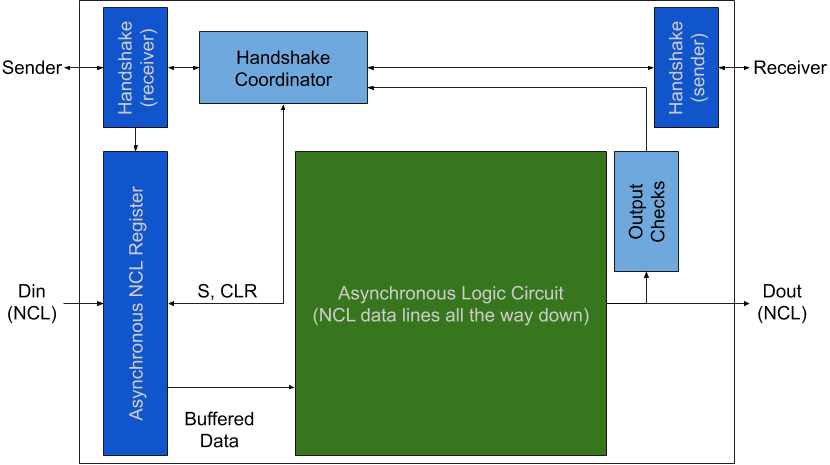

Asynchronous CPU Components
===========================

These CPU components are asynchronous.  They include adders, dividers,
pipelines, and other features.

# Major Architecture

Ultimately, this RISC-V implementation will use an entirely asynchronous
architecture.  This consumes significant area, largely due to routing;
however, routing is between directly-attached components generally, and
should not be a problem in and of itself.

In general, an Asynchronous CPU operates in a synchronous system as below:
```
       __________________________________________________________
      |   _______________             ________________________   |
  CLK-|--|  Transceiver  |=Handshake=| Asynchronous circuitry |  |
D0..n=|==|               |=D[0]0..n==|                        |  |
      |  |               |=D[1]0..n==|                        |  |
      |  |_______________|           |________________________|  |
      |__________________________________________________________|
```
Above, a transceiver operates as a clocked (synchronous) component and an
unclocked (asynchronous) component.  The asynchronous side experiences delay
controlled by the clock, but uses the asynchronous protocol.

Marcos Luiggi Lemos Sartori of the Pontifical Catholic University of Rio
Grande do Sul once [wrote](https://www.inf.pucrs.br/~calazans/publications/2017_MarcosSartori_EoTW.pdf):

> As far as the Author knows, this is both the first asynchronous RISC-V
> implementation and the first use of Go as a hardware description language.

The [ARV implementation](https://github.com/marlls1989/arv) appears to be a
RISC-V emulator written in Go, although the author notes:

> A smart asynchronous synthesis tool can extract the intended behaviour
> from the high level model and implement it in any such template.

So far as we are aware, the VHDL implementation presented here is the first
asynchronous RISC-V CPU hardware implementation, and the first using unbroken
NULL Convention Logic to implement delay-insensitive components.  Unlike
[previous work by Christensen, Jensen, Jorger, and Sparsø](https://backend.orbit.dtu.dk/ws/portalfiles/portal/4361393/Christensen.pdf), which implemented
an asynchronous TinyRISC™ TR41401 via delay elements, the RISC-V implementation
here uses NULL Convention Logic (NCL) and delay-insensitive registers to
overcome timing issues.

This CPU requires transceivers at every memory access point, including to
access any BRAM used as cache, DRAM used as main memory, or internal DSP and
multiplier facilities.  It provides a full VHDL implementation of all
facilities except internal cache to facilitate synthesization as an ASIC;
configurable support for internal use of FPGA facilities is included.

# Handshake

A completion-detection handshake allows for delay-insensitive components.  Such components are attached as such:
```
     Sender           Receiver
 _______________   _______________
| Ready    (in) |-| Ready   (out) |
| Waiting (out) |-| Waiting  (in) |
| d[0..x] (out) |=| d[0..x]  (in) |
|_______________| |_______________|
```
A strict handshake protocol ensures transitions on each side follow a state
machine in which data must be acknowledged seen, then not seen; sent, then
not sent; and so forth.  This protocol ensures each sender holds the data
lines stable until the recipient acknowldeges it has a stable copy of the data,
and only sends data when a recipient *is* ready to receive data.

# NULL Convention Logic

Asynchronous components use a form of one-hot logic called NULL Convention
Logic.  Each bit has one of the following states:

```
High  Low  Value
   0    0   NULL
   1    0      0
   0    1      1
```

The `[1 1]` signal is invalid.  Completion detection circuits wait for all
bits to see `High XOR Low = 1` before signaling the completion of some action.

# Asynchronous Process

The asynchronous process relies on both the handshake and NCL to function.

Consider the below:
```
     Sender                   Adder                    Consumer
 _______________   ______________________________   ______________
| Ready    (in) |-| Ready   (out)   Ready    (in)|-| Ready  (out) |
| Waiting (out) |-| Waiting  (in)   Waiting (out)|-| Waiting (in) |
| d[0..x] (out) |=| d[0..x]  (in)   d[0..x] (out)|=| d[0..x] (in) |
|_______________| |______________________________| |______________|
```
Above, the **Sender** sends a computation to the **Adder**, which sends the
result to the **Consumer**.

Overall, an asynchronous component has the below general block diagram:



Think of the fancy parallel prefix adder as below:
```
        [Input]   (in) Waiting,  (Out) Ready
        |  |  |
       [Register]
        |  |  |  * Completion: input
        G  G  G
        | /| /|
        G  G  |
        | /|  |
        G  |  |
      / |  |  | * Completion: output
     [  Output  ] (Out) Waiting, (In) Ready

```
The component needs its data input to remain in place until its data output
is complete and no longer needed by the receiver of this output.  That means
all circuits must complete before this can propagate down.

The asynchronous register stores the data in a delay-insensitive manner (see
[the handshake components](handshake/), allowing the handshake to immediately
finish while the component processes the data.  The component becomes ready
for new data as soon as the next component has likewise stored the output
and signaled it has done so (by clearing `Ready`).

This coordination is necessary to ensure asynchronous components do not get
out of sync and produce bad data.  Clocked circuits assume every component
does its part in one clock cycle, while asynchronous circuits move data as
soon as the sender is ready to send and the receiver is ready to receive.
This can vary with electrical characteristics, temperature, and which
component is in use—parallel adders, slow multipliers, fast incrementers,
all with different amounts of delay, and all operating at full speed rather
than at the speed of the slowest, even when those speeds change.
