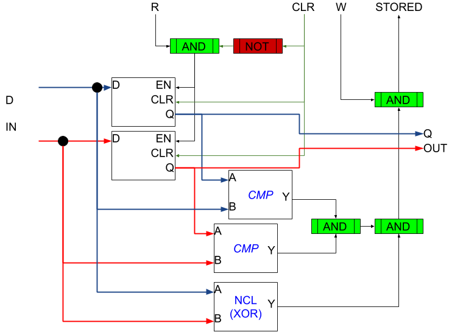

Asynchronous Handshake
======================

A completion-detection handshake allows for delay-insensitive components.

Consider a component shaped as below:
```
  ______________________________
-| Ready  (out)   Ready    (in) |-
-| Waiting (in)   Waiting (out) |-
=| d[0..x] (in)   d[0..x] (out) |=
 |______________________________|
```
The above has a data input and a data output.  Another component with the same
interface would send and received data over the same interface.

This allows only the transitions below:
```
Receiver:
W[in]   R[out]   Transition
1       1        R[out] <= 0
0       0        R[out] <= 1

Sender:
R[in]   W[out]   Transition
1       0        W[out] <= 1
0       1        W[out] <= 0
```

The initialization  state is `W[out]=0, R[out]=X`, with `R[out]` transitioning
to `1` when ready.  To be more clear:
```
     Sender           Receiver
 _______________   _______________
| Ready    (in) |-| Ready   (out) |
| Waiting (out) |-| Waiting  (in) |
| d[0..x] (out) |=| d[0..x]  (in) |
|_______________| |_______________|
```
This proceeds as follows:
```
Sender:   W = 0        State: R=0, W=0
Receiver: R = 0        State: R=0, W=0
Sender becomes ready to send data (valid here...)
Sender:   d <= [data]
Receiver becomes ready to accept new data
Receiver: R <= 1       State: R=1, W=0
(...or sender can become ready to send here)
Sender:   W <= 1       State: R=1, W=1
Receiver stores the data and no longer needs d
Receiver: R <= 0       State: R=0, W=1
Sender acknowledges (any state on Sender's end)
Sender:   W <= 0       State: R=0, W=0
```

The Receiver must buffer the data or the entire asynchronous CPU will
simply wait until each single instruction is 100% complete and the
output sent to main RAM before fetching the next single instruction.

To do this, we use a delay-insensitive flip flop as a one-bit NCL
register:



This register outputs `STORED` or `St` when `D` is non-NULL, `Q = D`,
and `W` is `1` (i.e. sender is signaling the data on `D` is valid).
In this way, it is insensitive to its own delay and the delay of the
sending circuit.

Assembling these into an n-bit register produces the below black box:
```
  __________
=| D     EN |-
-| W    CLR |-
 |       St |-
 |        Q |=
 |__________|
```
The receiver checks `Q` (for valid non-NULL data) and `St` (for the
register indicating that it itself considers the data non-NULL and
stored) before transitionig `R` from `1` to `0`.

For proper operation, the receiver should not transition `R` from `0`
to `1`  until first setting `CLR`, then validating the circuit's final
output is NULL.  This ensures the circuit has been flushed and won't
generate spurious non-NULL output when new data comes in.

Once the receiver has validated its output is flushed, it transitions
`CLR` to `0` and `R` to `1`.  The `EN` signal is suppressed until `CLR`
is `0` so as to avoid an `EN AND CLR` situation (although the DFF
respects `CLR` over `EN` in its current implementation).

Importantly, `D` must remain valid until `R` transitions to `0`.  The
sending circuit can output `D` continuously when `R` is `0`, and so
can send its output directly to `D` with no buffer.

The sender should transition its output to NULL and then to valid;
however, the NCL check fails on both `00` and `11`, so even if the
circuit glitches and stores `Q = D = 11`, it will not proceed.  This
suppresses the data hazard.  Consider transitioning from `10` to
`01`:
```
10 => 00 => 01
10 => 11 => 01
```
The supposed flush moves to `00`, indicating NULL; but a glitch where
the `0` to `1` transition arrives before the corresponding `1` to `0`
transition moves to `11`, which is treated as NULL.  The circuit
behaves identically in either case.  The flush is to ensure a
fully-valid but *incorrect* value does not land on `D` while `W` is
`1`, which would result in the receiver accepting the data as
correct and processing it—a severe data hazard.

Altogether, the handshake protocol and the delay-insensitive NCL
registers provide for asynchronous data transfer between internal
components.
